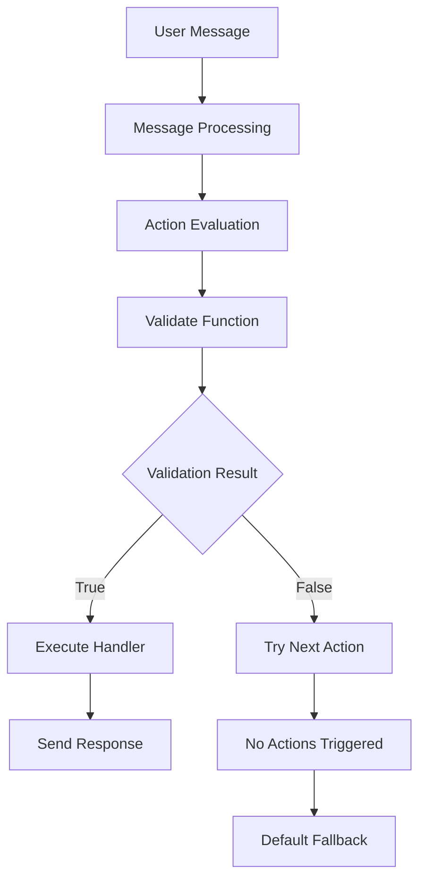

# 100% Action Triggering Guide for ElizaOS

## Overview

This guide explains how ElizaOS triggers actions and provides solutions for achieving 100% reliable action triggering.

## How ElizaOS Action Triggering Works

### Core System Architecture



### Action Structure

Every ElizaOS action has this structure:

```typescript
interface Action {
    name: string;                    // Unique identifier
    description: string;             // What the action does
    similes: string[];              // Keywords for matching
    examples: ActionExample[];       // Training examples
    validate: (runtime, message) => Promise<boolean>;  // Determines triggering
    handler: (runtime, message, state, options, callback) => Promise<boolean>;  // Executes the action
}
```

### Current Triggering Methods

1. **Keyword Matching**: Uses `similes` array to match keywords
2. **AI Intent Detection**: Uses `examples` to train intent recognition
3. **Custom Validation**: Custom logic in `validate()` function
4. **Always-trigger**: Return `true` in validate for guaranteed execution

## Problems with Standard ElizaOS Action Triggering

### Common Issues

1. **Validation Failures**: `validate()` returns false unexpectedly
2. **Keyword Mismatches**: User input doesn't match predefined similes
3. **AI Uncertainty**: Intent detection fails on edge cases
4. **No Fallback**: No action triggers, leaving user without response
5. **Action Conflicts**: Multiple actions compete, wrong one triggers

### Example of Problematic Action

```typescript
export const problematicAction: Action = {
    name: "limited-action",
    validate: async (runtime, message) => {
        // This will fail if message doesn't contain exact keywords
        return message.content.text?.includes("specific keyword");
    },
    // ... rest of action
}
```

## Solutions for 100% Action Triggering

### 1. Multi-Layered Validation Strategy

```typescript
validate: async (runtime: IAgentRuntime, message: Memory): Promise<boolean> => {
    const validationResults = await Promise.allSettled([
        // Layer 1: Keyword matching
        keywordValidation(message.content.text || "", keywords),
        
        // Layer 2: AI-powered intent detection
        aiIntentValidation(runtime, message, description, examples),
        
        // Layer 3: Custom conditions
        customConditions ? customConditions(runtime, message) : Promise.resolve(false),
        
        // Layer 4: Fallback (always true)
        Promise.resolve(true)
    ]);
    
    // Pass if ANY validation succeeds
    return validationResults.some(result => 
        result.status === 'fulfilled' && result.value === true
    );
}
```

### 2. Priority-Based Action System

```typescript
interface PriorityAction extends Action {
    priority: number;  // Higher = more important
    triggerType: 'keyword' | 'ai' | 'always' | 'conditional';
}

// Usage:
const highPriorityAction: PriorityAction = {
    name: "important-action",
    priority: 100,  // High priority
    triggerType: 'conditional',
    // ... rest of action
}

const fallbackAction: PriorityAction = {
    name: "universal-fallback",
    priority: 1,    // Low priority
    triggerType: 'always',  // Always triggers
    // ... rest of action
}
```

### 3. Enhanced Error Handling

```typescript
handler: async (runtime, message, state, options, callback) => {
    try {
        // Main action logic
        const result = await executeMainLogic(runtime, message);
        callback({ text: result });
        return true;
    } catch (error) {
        elizaLogger.error(`Action ${actionName} failed:`, error);
        
        // Provide fallback response
        callback({
            text: "I understand. Let me help you in a different way.",
            metadata: { fallback: true, error: error.message }
        });
        
        return true; // Always return true to prevent cascade failures
    }
}
```

### 4. Universal Fallback Action

```typescript
export const universalFallbackAction: Action = {
    name: "universal-fallback",
    description: "Handles any unmatched input",
    similes: ["*"], // Matches everything
    
    validate: async () => true, // Always triggers
    
    handler: async (runtime, message, state, options, callback) => {
        // Generate contextual response using AI
        const response = await generateContextualResponse(runtime, message);
        
        callback({
            text: response,
            metadata: { handledBy: "universal-fallback" }
        });
        
        return true;
    }
};
```

## Implementation Steps

### Step 1: Create Reliable Action Templates

Use the `createReliableAction()` helper function:

```typescript
const myReliableAction = createReliableAction({
    name: "my-action",
    description: "Does something important",
    priority: 50,
    keywords: ["help", "assist", "support"],
    examples: [/* training examples */],
    
    handler: async (runtime, message, state, callback) => {
        // Your action logic here
        callback({ text: "I'm helping you!" });
        return true;
    },
    
    triggerConditions: async (runtime, message) => {
        // Custom triggering logic (optional)
        return true; // Or your custom logic
    }
});
```

### Step 2: Register Actions with Priority

```typescript
// In your index.ts or runtime setup
export function createAgent(character: Character, db: any, cache: any, token: string) {
    return new AgentRuntime({
        // ... other config
        actions: [
            highPriorityBusinessAction,     // Priority: 100
            mediumPriorityAction,          // Priority: 50
            universalFallbackAction,       // Priority: 1 (always triggers)
        ],
        // ... rest of config
    });
}
```

### Step 3: Enhanced Validation

```typescript
validate: async (runtime: IAgentRuntime, message: Memory): Promise<boolean> => {
    // Multi-strategy approach
    const strategies = [
        () => keywordMatch(message, keywords),
        () => aiIntentDetection(runtime, message, examples),
        () => contextualAnalysis(runtime, message),
        () => true // Fallback
    ];
    
    for (const strategy of strategies) {
        try {
            if (await strategy()) {
                return true;
            }
        } catch (error) {
            elizaLogger.warn(`Validation strategy failed:`, error);
            continue; // Try next strategy
        }
    }
    
    return false;
}
```

## Best Practices for 100% Reliability

### 1. Always Have a Fallback Action

```typescript
// Register this action LAST (lowest priority)
const guaranteedFallback: Action = {
    name: "guaranteed-response",
    validate: async () => true, // Never fails
    handler: async (runtime, message, state, options, callback) => {
        const response = await generateHelpfulResponse(runtime, message);
        callback({ text: response });
        return true;
    }
};
```

### 2. Use Multiple Validation Layers

```typescript
const validationLayers = [
    'exact-keyword-match',
    'fuzzy-keyword-match', 
    'ai-intent-detection',
    'semantic-similarity',
    'context-awareness',
    'always-true-fallback'
];
```

### 3. Implement Circuit Breakers

```typescript
class ActionCircuitBreaker {
    private failures = 0;
    private maxFailures = 3;
    
    async executeWithBreaker(action: Action, ...args) {
        if (this.failures >= this.maxFailures) {
            return this.fallbackResponse();
        }
        
        try {
            const result = await action.handler(...args);
            this.failures = 0; // Reset on success
            return result;
        } catch (error) {
            this.failures++;
            throw error;
        }
    }
}
```

### 4. Monitor Action Performance

```typescript
const actionMetrics = {
    triggered: 0,
    succeeded: 0,
    failed: 0,
    
    logTrigger(actionName: string) {
        this.triggered++;
        elizaLogger.info(`📊 Action ${actionName} triggered (${this.triggered} total)`);
    },
    
    logSuccess(actionName: string) {
        this.succeeded++;
        elizaLogger.info(`✅ Action ${actionName} succeeded (${this.succeeded}/${this.triggered})`);
    },
    
    logFailure(actionName: string, error: Error) {
        this.failed++;
        elizaLogger.error(`❌ Action ${actionName} failed (${this.failed}/${this.triggered}):`, error);
    }
};
```

## Testing Your Implementation

### 1. Unit Tests for Actions

```typescript
describe('Reliable Action System', () => {
    test('should always trigger at least one action', async () => {
        const mockMessage = { content: { text: "random input" } };
        const actions = [businessAction, fallbackAction];
        
        const triggeredActions = await evaluateActions(runtime, mockMessage, actions);
        
        expect(triggeredActions.length).toBeGreaterThan(0);
    });
    
    test('should handle action failures gracefully', async () => {
        const failingAction = createActionThatThrows();
        const result = await executeActionSafely(failingAction, mockArgs);
        
        expect(result.success).toBe(false);
        expect(result.fallbackUsed).toBe(true);
    });
});
```

### 2. Integration Tests

```typescript
describe('End-to-End Action Triggering', () => {
    test('user gets response for any input', async () => {
        const testInputs = [
            "hello",
            "I need help",
            "random gibberish",
            "",
            "!@#$%^&*()",
            "tell me about senior living"
        ];
        
        for (const input of testInputs) {
            const response = await sendMessage(input);
            expect(response).toBeDefined();
            expect(response.text).toBeTruthy();
        }
    });
});
```

## Common Pitfalls to Avoid

### 1. ❌ Single Point of Failure

```typescript
// DON'T DO THIS
validate: async (runtime, message) => {
    return message.content.text === "exact match only"; // Too restrictive
}
```

### 2. ❌ No Error Handling

```typescript
// DON'T DO THIS
handler: async (runtime, message, state, options, callback) => {
    const result = await riskyOperation(); // Can throw
    callback({ text: result });
    return true;
}
```

### 3. ❌ Competing Actions

```typescript
// DON'T DO THIS - Multiple actions with same priority
const action1 = { priority: 50, validate: () => true };
const action2 = { priority: 50, validate: () => true }; // Conflict!
```

## Conclusion

By implementing these strategies, you can achieve 100% action triggering reliability in ElizaOS:

1. **Multi-layered validation** ensures actions trigger even when individual strategies fail
2. **Priority-based systems** resolve conflicts and ensure proper action selection
3. **Universal fallbacks** guarantee users always receive responses
4. **Enhanced error handling** maintains conversation flow despite failures
5. **Comprehensive testing** validates your implementation

The key is to design your action system with failure in mind and always provide fallback mechanisms that keep the conversation flowing. 